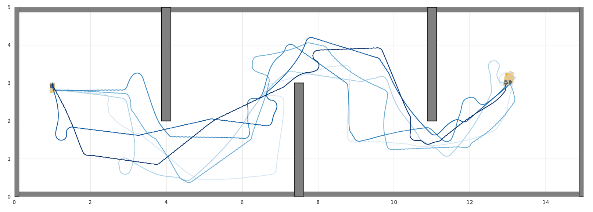

# RL-SBMP


## Codebase-Structure
This repository features the codebase used for the experiments I conducted as part of my Master Thesis on "Enhancing Sampling Based Kinodynamic Motion Planning with Reinforcement Learning Policies".
The repository is structured as follows:
- **/motion_planning**: meta module with all relevant components for the evaluation of the motion-planning algorithms
    - /kdrrt: the base RRT planner as well as the ao-rrt extension
    - /evaluator: module containing the implementation of the evaluation infrastructure (including various experiment configurations)
    - /maps: target map configurations as well as the Map2D base class
    - /nearest_neighbour: datastructures for the nearest-neighbour search (KDTree or purely brute-force)
    - /planner_configs: various planner configurations. the ones for the experiments covered in the thesis can be found under /thesis
    - /Trees: tree datastructures used for tree-based planners
    - /utils: various motion-planning utility classes. Includes the TrajectoryAnalyzer I used to visualize the experiment results
- **/rl**: meta module storing all modules and scripts relevant for the training of the control policy
  - /environments: (OpenAi-Gym) Environment definitions for the target dynamics
  - /onnx_helper: includes script to export the trained models to the ONNX-format, as well as a wrapper for loading and querying the model in the ONNX-runtime
  - /tools: modules used for generating starting configs, as welll as test the trajectories outputted by the model
- **/artist**: module with classes used to render the state of the Target Systems 
- **/driver**: module with classes used to steer the dynamical systems
- **/dynamics**: module with the classes defining the target system dynamics
- **/spaces**: contains the classes defining the used state and action-spaces contains the classes defining the used state and action-spaces
- **/project\_utils**: root utility classes. includes transformations.py which features the methods used for the transformation between frames, as well as the sympy based homogeneous transformation matrix construction.
- **/utils**: features utility class for interacting with the git repository (extract current commit hash etc.)
- **/tmux**: tmux scripts for setting up multi-pane-working-environments. Currently includes the two scripts used to run the evaluations on the cluster

## Setup
### Creating a virtual environment and installing all relevant modules
```bash
python -m venv venv
source venv/bin/activate
pip install -r requirements.txt
```
## RL
### Example
To start the training of the second order car with the curriculum learning setup using the first 100 bootstrap starting configs run
```bash
python rl/train.py rl.environments.accl_car --config rl/configs/thesis/curriculum/curriculum_learning_config_100.yaml -n 1_000_000
```
The experiment data (tensorboard logs, models, etc.)  will be stored in the rl/data directory under a newly created directory for the current git hash.
If the repository is dirty (contains not yet committed changes), the training script will exit with a warning.
You can skip the git check with the use of the `--skip_git_check` flag, but in this case all output will be stored in the directory `rl/data/dirty_repo`
### Help
To see the available command line arguments, use
```bash
python rl/train.py --help
```

## Evaluation
### Example
The evaluation setup for the sampling based motion planners is mostly implemented in `motion_planning/evaluator/motion_planning_evaluator.py`.
To start the evaluation of the AO-RRT-RL system for the second-order car in the ZigZag map use
```bash
python motion_planning/evaluator/motion_planning_evaluator.py ao-rrt --conf motion_planning/evaluator/experiment_configs/cluster/thesis/second-order-car/zigzag/2023-07-25_9_second_order_car_zigzag_rl.yaml 
```
This will take a while, as the evaluator will run 25 iterations, with a runtime-cap of 240 sec each.
To enable output (which will obviously impact the performance of the system) use the `--verbose` flag.
The resulting trajectories will be stored in `motion_planning/evaluator/experiment_data`. Like with the RL training setup explained
above, the experiment output (intermediate and final trajectories) is stored based on the current commit hash (and timestamp).
If the repository contains not yet commited changes, starting the evaluation will fail (unless the `--skip_git_check` flag is set).

### Help
To see the available command line arguments, use
```bash
python motion_planning/evaluator/motion_planning_evaluator.py --help
```


