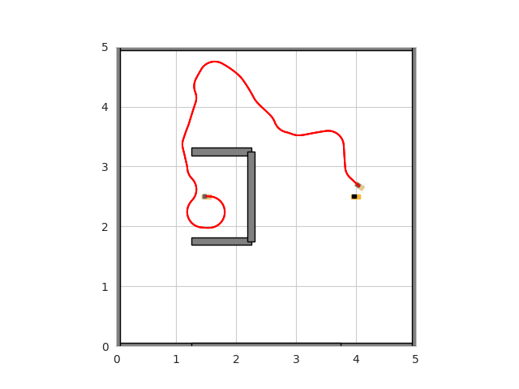
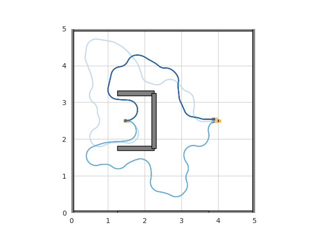
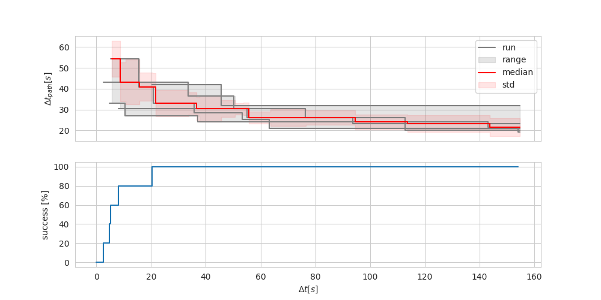
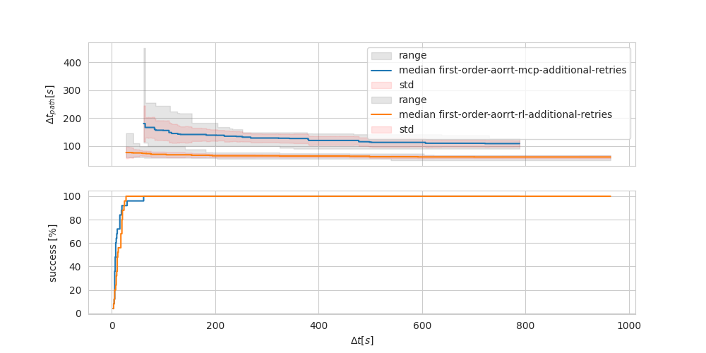

# Utilities

## TrajectoryAnalyzer
Tool which can be used to generate plots based on trajectories in the input directory.
### Usage
(run from project root)
```bash
usage: TrajectoryAnalyzer.py [-h] [--input INPUT] [--output OUTPUT] [--map MAP] {cmd}

cmd:
  {trajectory_plots,
  overlay_plot,
  cost_evolution_plot,
  cost_evolution_plot_comparison}

options:
  -h, --help            show this help message and exit
  --input INPUT, -i INPUT
  --output OUTPUT, -o OUTPUT
  --map MAP, -m MAP
```
#### Plots
##### `trajectory_plots`

##### `overlay_plot`

##### `cost_evoluation_plot`

##### `cost_evolution_plot_comparison`



#### Example
```bash
 python motion_planning/utils/TrajectoryAnalyzer.py generate_cost_evolution_plot_meta_v2 \
    --input motion_planning/evaluator/experiment_data/dirty_repo/2023-06-25_0_second_order_aorrt_bugtrap_rl
```
